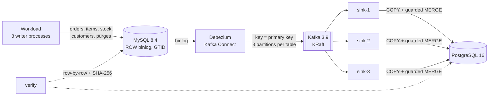

# CDC Pipeline: MySQL → Debezium → Kafka → PostgreSQL

[](https://github.com/AnuragBhandary/CDC-Pipeline/actions/workflows/ci.yml)


Log-based change data capture that keeps a PostgreSQL replica in sync with an operational MySQL
database (**inserts, updates and deletes**) in about a tenth of a second, and *proves* the replica
equals the source after crashes and live schema changes.

Debezium reads the MySQL binlog and publishes every row change to Kafka, keyed by primary key. A
Python sink (confluent-kafka + psycopg 3) applies the changes idempotently, keyed on primary key
and **binlog position**, and evolves the target schema on the fly.

### Measured results ([details](docs/RESULTS.md))

| 1,000,021 row changes at 3,100/s · 3 sinks · column added at 500k · a sink SIGKILLed at 700k | |
|---|---|
| Replication lag, MySQL commit → PostgreSQL commit | **p50 89 ms · p95 141 ms · p99 183 ms** (max 3.8 s, inside the kill window) |
| Replica vs source, row by row + SHA-256 per table | **identical**: 0 missing, 0 extra, 0 mismatched across 440k rows |
| Live `ALTER TABLE ... ADD COLUMN` | picked up with no pause or restart |
| Sink killed mid-transaction / between DB and Kafka commits | replica identical after restart (deterministic tests) |

## How it works



| Guarantee | How |
|---|---|
| Per-row ordering | Debezium keys by primary key → one partition per row → one consumer at a time |
| Replays are no-ops | each target row stores its binlog position `(file, pos, row)`; `ON CONFLICT … WHERE target.position < incoming.position` |
| No loss on crash | commit PostgreSQL, *then* Kafka offsets: at-least-once delivery with idempotent apply |
| Deletes can't be undone by replays | soft deletes keep the position, so a replayed insert stays rejected |
| Schema changes without downtime | the Connect schema in every event → `ALTER TABLE ADD COLUMN` in the same transaction, under an advisory lock |
| Fast failover | static group membership and cooperative-sticky rebalancing |
| Proof | catch-up barrier (marker row + zero consumer lag), then per-table row comparison and SHA-256 |

Design, the probe of real Debezium events that justified the position key, alternatives and
known limits: **[docs/DESIGN.md](docs/DESIGN.md)**.

## Quick start

```bash
make install          # uv sync
make up               # MySQL, Kafka (KRaft), Kafka Connect + Debezium, PostgreSQL
make demo             # reset, seed 22k rows, register the connector (snapshot starts)
make sink             # terminal 1 (N=2 make sink in terminal 2 for a second consumer)
make load             # terminal 3: 100k changes at 3,000/s, column added halfway
make verify           # wait for catch-up, compare every table, exit 1 on any difference
```

`make bench` reproduces the 1M-event run (~6 min); `make bench-smoke` is a 1-minute version.

## Tests

`make test`: 28 tests, 93% coverage, against the real stack (CI runs it too, Debezium included):

- **decoder**: Connect logical types (exact decimals, microsecond timestamps, dates), deletes,
  tombstones, position ordering across binlog files
- **applier**, against PostgreSQL: newest-per-key within a batch, replays are no-ops, older
  events never overwrite newer, a replayed insert can't resurrect a deleted row, rows sharing a
  binlog `pos`, added columns, mixed schema versions in one batch, DECIMAL widening, and
  incompatible type changes stop the sink
- **end to end**: snapshot + streaming + live schema change with two sinks; a sink SIGKILLed
  **inside** its PostgreSQL transaction; a sink SIGKILLed **between** the PostgreSQL commit and
  the Kafka commit (the batch is redelivered and skipped as stale). Every test ends with a
  row-by-row comparison of all tables.

## Layout

```
src/cdcpipe/   decode (Debezium → typed rows), sink (consumer + Applier), connector (REST),
               workload (generator), verify (barrier + checksums), cli
bench/         run_benchmark.py
docs/          DESIGN, RESULTS (+ results-1m.json), INTERVIEW
```
